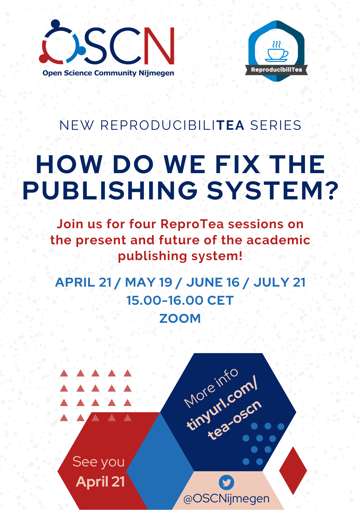

ReproducibiliTea is a global initiative bringing journal clubs on reproducibility and open science to, at the time of writing, about 20 countries spread over 4 continents. There is more information on the initiative and current chapter on the [ReproducibiliTea website](https://reproducibilitea.org/).

## Next event
Our next event will be on **May 19**, 2021, 15:00 CEST. For more information, see [here](https://openscience-nijmegen.nl/reproTea14/). 
For all future meetings, see our [agenda](https://openscience-nijmegen.nl/_pages/agenda/).

## New series in April - July 2021: Fixing the publishing system series

From April onwards, we’re going to do ReproducibiliTea a little differently. For three to four sessions, we will focus on a particular aspect of the academic world, identify its problems and brainstorm solutions. The first topic we will tackle is the publishing system. Ever been bothered by the fact that publishing Open Access feels a lot like being the victim of grand larceny? Or that it can take years to get through the review process, only for your paper to be rejected (yet again)? Ever heard of the 450 Movement? In the first session of this new series, we will diagnose exactly what’s wrong with the current publishing system and identify its problems. In the second (and possibly third) session, we will discuss concrete solutions to those problems. In the final session, we will sum up the discussion and fine-tune our solutions. At the end of the series, we also plan to write a (short) report on the outcome of these three to four sessions, which we will make available on the OSCN website as a white paper and possibly also look to publish in a journal (if we still have confidence in the publishing system after we’re done!). Anyone who comes to one or more of the sessions will of course be acknowledged as a contributor to the report and paper.

## Objectives
- learn about cool papers/initiatives related to open open science and reproducibility
- have friendly and engaging discussions about open science and reproducibility
- meet new people interested in these topics in the Radboud campus
- :tea: :tea: :tea:

## Paper suggestions
We want this journal club to reflect the interests of its members--you!
You can add your suggestions and contact information [here](https://docs.google.com/spreadsheets/d/1efHsgzEu9OqKNRk9EARDNL3gBfsPNRgbdt7-PhfWS-U/edit?usp=sharing).
Suggestions can be peer-reviewed papers, but also preprints, blog posts, iniatives etc.

When you suggest papers for discussion please keep these guidelines in mind:
- the topic of the paper should be relevant for open science (e.g.  pre-registration, replicability, reproducibility, robustness, open access, transparency, inclusivity, diversity, philosophy of science)
- length should not exceed 12 pages (for journal-formatted papers; 24 for double-spaced ones)
- not too technical please--discussion should be accessible to be people of different backgrounds!

## Practical info
The journal club will meet monthly (usually the 3rd Wednesday of the month; see exact dates below) at **15:00**. During the lockdown, meetings take place **online**. 

The person who suggested the topic of discussion will introduce it in 10 minutes or under and then we discuss! Meetings will last no longer than an hour.

In the presentation of the paper/topic of discussion identify:
- the *problem* the paper addresses
- the *solution* the paper advocates
- the *relevance* of the paper (for the presenter or more generally)
- what is *special* about the paper
- the *limitations* of the paper

## Schedule
This is the schedule for all upcoming meetings:

| Day | Paper(s) | Keywords | Presenter |
|-----|----------|----------|-----------|
| 2020 | - | - | - |
| January 15th | [Simmons, J. P., Nelson, L. D., & Simonsohn, U. (2011)](https://journals.sagepub.com/doi/full/10.1177/0956797611417632) | preregistration, *p*-hacking, transparency | Johannes |
| February 19th | [Bishop, D. V. M. (2018)](https://doi.org/10.1177/2515245918776632) | transparency | Eirini |
| March 18th | CANCELLED |  |  |
| April 15th | [Gernsbacher, M. A. (2018)](https://doi.org/10.1016/j.tics.2018.07.002) | incentives, the "system" | Eirini |
| May 20th | [van Rooij & Baggio (2020)](https://psyarxiv.com/7qbpr/) | theory building | Johannes |
| June 24th | [Scheel, Schijen, & Lakens (2020)](https://psyarxiv.com/p6e9c) | publication bias, preregistration, registered reports | Judit |
| September 16th | [Simonsohn (2015)](http://urisohn.com/sohn_files/wp/wordpress/wp-content/uploads/2019/01/small-telescopes-detectability-published.pdf) | publication bias,  replication | Johannes |
| October 21th | [Szollosi & Donkin (preprint)](https://psyarxiv.com/suzej/) | theory building, confirmatory vs. exploratory research | Lena |
| November 18th |  [Vazire & Holcombe (2020)](https://psyarxiv.com/kgqzt/) | self-correction, open science movement | Lena |
| December 16th |  [Whitaker & Guest (2020) Blogpost: #bropenscience is broken science](https://thepsychologist.bps.org.uk/volume-33/november-2020/bropenscience-broken-science) | inclusivity, open science movement | Eva |
| 2021 | - | - | - |
| January 20th |  [Scheel et al. (2020)](http://leotiokhin.com/assets/uploads/Scheel_etal_2020_HypothesisTesters_PPS.pdf) | hypothesis testing | Eva |
| February 17th |  [Locke (2009)](https://journals.sagepub.com/doi/pdf/10.1111/j.1745-6924.2009.01090.x) | research methods | Rowan |
| March 17th |  [Tiokhin et al. (2021)](https://journals.plos.org/plosone/article?id=10.1371/journal.pone.0246675) | publishing system | Lena |
| April 21th |  Series: How do we fix the publishing system? | - | Eva, Johannes, Lena |
| May 19th |  Series: How do we fix the publishing system? | - | Eva, Johannes, Lena |
| June 16th |  Series: How do we fix the publishing system? | - | Eva, Johannes, Lena |

The next ReproducibiliTea will also be shown in the [Agenda](https://openscience-nijmegen.nl/_pages/agenda/).

## Inclusivity
Everyone is welcome :blush:

We want to hear from anyone who's interested in open science and reproducibility (pro or against) regardless of background, discipline, and career stage.

Do you have questions? You can contact us at **contact at openscience-nijmegen.nl**.
